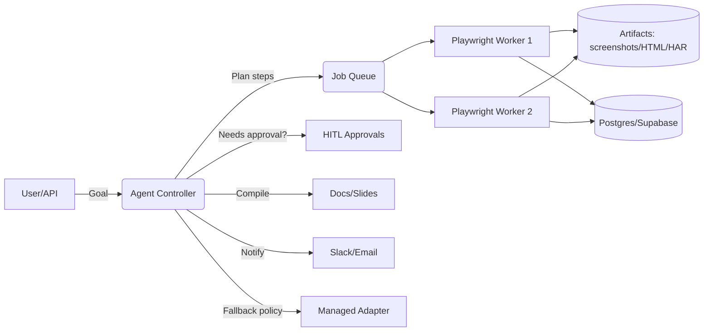

# DropFly WebOps Agent — PRD, Architecture & Go-To-Market (v1.0)

**Date Logged:** 2025-08-24
**Status:** Complete PRD for autonomous web operations agent
**Market Assessment:** EXTREMELY HIGH VALUE PRODUCT

---

# 📄 Document: DropFly WebOps Agent — PRD, Architecture & Go-To-Market (v1.0)

**Owner:** DropFly (CEO: You)
**Audience:** Senior engineers, product, security, GTM
**Status:** Draft for build start — Day 1
**Delivery Model:** Hybrid (Self‑hosted Playwright core + optional Gobii‑style adapter)

---

## 0) Executive Summary

**What:** An autonomous web-operations agent that can **research, browse, click, fill forms, upload/download files, and compile deliverables** with approvals, evidence, and audit trails.
**Who for:** SMBs and regulated teams that need repeatable web workflows (intake forms, procurement, RFP portals, price tracking, competitor intel) done **reliably and safely**.
**Why us:** We combine **agentic autonomy** with **HITL approvals, citations/screenshots, secrets vaulting, allowlists/denylists**, and **cost controls**.
**How:** Self‑hosted **Playwright** browser fleet (headless by default) orchestrated by an **Agent Controller** (n8n + Code/LangGraph). Optional **Managed Adapter** for brittle sites.

---

## 1) Objectives & Non‑Goals

### Primary Objectives (MVP ≤ 2–3 weeks)

1. **Deep Research → Brief** with **citations & screenshots**.
2. **Act‑on‑Web**: login → navigate → form‑fill → upload/download → confirm.
3. **HITL**: Approve/Pause/Reject gates for sensitive actions (emails, purchases, posts).
4. **Auditability**: Run timeline, action log, screenshots, page snapshots (HTML/HAR).
5. **Safety**: Domain allowlists/denylists, max actions/run, prompt‑injection sanitizer, secret placeholders.

### Non‑Goals (MVP)

* No public marketplace; no end‑user templating UI yet.
* No multi‑tenant SSO; no usage-based billing in-app (tracked but billed manually in MVP).

---

## 2) Success Metrics (Day‑1 KPIs)

* **Task success rate (E2E)** ≥ 80% on target sites (without human edits).
* **Avg. actions per successful task** (efficiency) — baseline then trend down.
* **Block rate** (anti‑bot/CAPTCHA) and **solve rate** with fallback policy.
* **Approval touch rate** ≤ 1 per task (after first week of tuning).
* **Unit cost per action** within budget cap; **gross margin** ≥ 80% on paid tiers.

---

## 3) Use‑Cases (Phase I Templates)

1. **Law intake ops (LawFly Pro)**: Client intake portal auto‑fill + document upload + confirmation email.
2. **Procurement/RFP portals**: Vendor forms + doc submissions + status checks.
3. **Competitor/price tracking**: Crawl → normalize → daily brief.
4. **Executive research**: Goal → search → read → cite → summarize → deliver deck.

---

## 4) System Architecture

### 4.1 Overview

* **Agent Controller (n8n + Code/LangGraph)** implements **Plan → Act → Observe → Revise** loop.
* **Browser Workers**: Playwright in Docker (Chromium), **headless** by default; headed for debug/replay.
* **Job Queue**: Redis/SQS — step dispatch, retries, backoff.
* **State & Memory**: Postgres/Supabase (runs, steps, artifacts, pages, credentials), **pgvector** for retrieval.
* **Artifacts Store**: S3 (screenshots, HTML snapshots, HAR/video, CSVs, generated docs).
* **Managed Adapter (Optional)**: External browser‑agent API behind an internal tool interface.
* **HITL**: Slack/Inbox Approvals for email, purchases, posts, credential use, or irreversible actions.



### 4.2 Core Components

* **Planner/Policy**: task decomposition, tool routing, budgets, stop conditions.
* **Browser Actioner**: Navigate, click, fill, attach files, handle downloads, pagination, dialogs.
* **Parser/Reader**: Readability/trafilatura snapshot → clean text → chunk for LLM.
* **Evidence Engine**: Auto‑capture screenshots, page HTML, and link → citation index.
* **Safety Layer**: Domain allowlist/denylist, max actions/run, prompt‑injection sanitizer, secret placeholders.
* **Observability**: Structured logs, event timeline, HAR/video, error screenshots.

### 4.3 Data Model (initial)

**runs**(id, goal, status, started\_at, ended\_at, budget\_tokens, budget\_actions, user\_id)

**steps**(id, run\_id, type, input, output, started\_at, ended\_at, error, tokens\_in, tokens\_out, actions\_count)

**pages**(id, run\_id, url, raw\_html\_ref, text\_ref, screenshot\_ref, status\_code, detected\_injection\_flag)

**artifacts**(id, run\_id, type \[csv|doc|slide|pdf|json], uri, meta)

**credentials**(id, label, domain, secret\_ref, last\_used\_at, policy \[allow/deny], rotation\_at)

**approvals**(id, run\_id, step\_id, type, requested\_at, status, actor, notes)

---

## 5) API Surface (internal, for parity with future SaaS)

* `POST /v1/agents` — create agent (policy, tools, domains)
* `POST /v1/runs` — start job (goal, constraints, inputs)
* `GET /v1/runs/{id}/events` — server‑sent events of actions/logs
* `GET /v1/runs/{id}/artifacts` — list/download outputs
* `POST /v1/approvals/{id}` — approve/deny
* `POST /v1/secrets` — store credentials (placeholder mapping)

---

## 6) Tech Stack (v1 picks)

* **Browser**: Playwright (Chromium) in Docker; headless by default; persistent contexts per domain.
* **Controller**: n8n + Code/LangGraph; multi‑model router (cheap loop model + strong summarizer).
* **Queue**: Redis (dev) → SQS (prod).
* **DB**: Postgres/Supabase + **pgvector**; Prisma/Drizzle ORM.
* **Storage**: S3 for artifacts; signed URLs.
* **Search**: SERP API (or Tavily) → fetch → parse.
* **Proxies**: Datacenter → auto‑escalate to Residential on block; CAPTCHA solver optional.
* **Auth**: JWT for API; service accounts for third‑party APIs.
* **Infra**: AWS ECS/Fargate or k8s; IaC via Terraform.

---

## 7) Security & Compliance

* **Secrets Vaulting:** Agent uses **placeholders**; runtime injects real creds. Never expose plaintext secrets in prompts or logs.
* **Allow/Deny Lists:** Per‑agent domain policy; per‑domain rate limits; robots.txt respect (configurable per client contract).
* **Prompt‑Injection Defense:** Strip scripts; sanitize page text; safe‑prompt wrappers with cite‑only mode.
* **Approvals:** Mandatory for purchases, external emails, social posts, credential use.
* **Audit Trail:** Immutable event log; signed report bundles (hash of artifacts) for compliance.
* **Data Residency:** S3 bucket and DB region pinning; per‑client tenancy option (Enterprise).

---

## 8) UI/UX Blueprint (Operator Console)

### Screens

1. **Runs** — table with status, progress, actions, cost, created by; filter by agent, domain, time.
2. **Run Detail** — left: step timeline; right: screenshot viewer, HTML preview, extracted text, console log.
3. **Approvals** — queue with Approve/Pause/Reject and notes; SLA timers.
4. **Artifacts** — list of generated CSVs/Docs/Slides; quick preview; download link.
5. **Agents & Policies** — domain rules, budgets, model selection, proxy/CAPTCHA settings, credentials map.
6. **Settings** — keys, webhooks, Slack workspace, email sender, data retention.

### UX Principles

* **Evidence‑first** (show sources/screenshots beside claims).
* **One‑click rollback** (retry from step N).
* **Safe defaults** (max actions 150/run; token cap; domain allowlist only).
* **Keyboard/CLI parity** for pro users.

---

## 9) Financials & Pricing (initial model)

**Unit:** an **Action** = navigate/click/fill/fetch step executed by a worker.
**Primary costs:** compute (browser time), proxies (fraction of actions), CAPTCHA solves (rare), LLM tokens, storage.

**Starter Pricing (suggested):** \$49/mo → 300 actions + 5 research runs; \$0.03/action overage
**Growth:** \$199/mo → 2,500 actions + 30 runs
**Pro:** \$599/mo → 10,000 actions + 100 runs
**Enterprise:** custom → dedicated browser pods, SSO, SLAs, on‑prem option

**Target margin:** ≥ 80% blended.
**Notes:** Enforce per‑run budgets (actions & tokens). Cache parsed pages. Route summaries to cheaper models unless flagged.

---

## 10) Competitive Landscape (snapshot)

* **API‑first browser agents** (Gobii‑style): Programmable jobs with managed browser fleets. We differentiate on **HITL, vaulting, and evidence packs**.
* **Scrape platforms** (Apify/Browse AI/Octoparse): Strong extraction & monitoring; weaker on full act‑on‑web autonomy. We compete on **workflow completion**, not just data.
* **Headless browser services** (Browserless et al.): Infra only; we're the autonomy and compliance layer on top.
* **Hyped "research" agents** (Manus‑like): Wide parallel research. We implement controlled parallelism with **governance** and **source‑pinning**.

**Positioning tagline:** *"Do real work on the web—with approvals, evidence, and guarantees."*

---

## 11) Roadmap

### Phase 0 (Week 1) — Foundations

* Dockerized Playwright worker image; Redis queue; Postgres schema; S3 artifact pipeline; n8n controller skeleton; Slack approvals.

### Phase 1 (Weeks 2–3) — MVP

* Deep‑research pipeline (search → fetch → parse → cite → brief).
* Act‑on‑web skills: auth, forms, pagination, downloads, uploads.
* Evidence engine (screenshots, HTML, HAR) + signed report bundle.
* Domain policies, budgets, and simple dashboard.

### Phase 2 (Month 2–3) — Beta SaaS

* Managed Adapter tool; proxy escalation policy; CAPTCHA integration; concurrency scaling.
* Multi‑tenant project/orgs; role‑based access; audit export.
* Templates: Law intake, RFP, price tracker, competitor watch.
* Billing telemetry (usage meters); webhook events.

### Phase 3 (Month 4–6) — SaaS v1

* In‑app billing (Stripe), plan limits, overages.
* SSO (Google/OIDC), customer‑managed keys, data‑residency controls.
* Template marketplace; public API; robust dashboard; SLA tooling.
* Hardening: chaos tests, failure drills, red‑team for prompt‑injection.

---

## 12) Risks & Mitigations

* **Anti‑bot friction** → Proxy escalation; fingerprint rotation; human fallback for CAPTCHA; per‑domain throttles.
* **Prompt‑injection/data exfiltration** → sanitize page text; safe‑prompts; strict citation mode.
* **Cost drift** → per‑run budgets; token/action caps; caching; compression; model routing.
* **Credential leakage** → placeholder secrets; never in prompts/logs/artifacts; rotation; least‑privilege.
* **Compliance** → immutable audit logs; evidence bundles; per‑client data residency.

---

## 13) Engineering — Day‑1 Tasks (senior dev)

1. **Repo setup** (mono‑repo): `apps/agent-controller`, `services/worker-playwright`, `packages/sdk`, `infra/terraform`.
2. **Worker image**: Node 20 + Playwright + Chromium; healthcheck; env‑driven proxy; download handler to S3.
3. **Queue**: Redis local; SQS in prod; exponential backoff.
4. **DB**: Migrate the schema above; seed admin user; Prisma/Drizzle.
5. **Artifacts**: S3 signed upload from worker; metadata rows in `artifacts` table.
6. **Controller**: n8n workflow (Code/LangGraph) implementing Plan→Act→Observe loop + Slack approvals.
7. **Policies**: Domain allowlist; budgets; stop conditions; approval gates.
8. **Parser**: Readability/trafilatura; chunk + hash; store page text + citation index.
9. **Run report**: Bundle screenshots + citations into a Doc/Slide; email via Gmail; Slack notify.
10. **CLI/Smoke tests**: `pnpm dev` start all; test plan against 2–3 public sites.

---

## 14) Acceptance Criteria (MVP)

* Submit a goal (CLI or API) → agent completes **research brief with 5+ citations & 3+ screenshots**.
* Complete a sample **form‑fill workflow** (login → fill → upload → submit → confirmation captured).
* Evidence pack: zip with logs, screenshots, HTML, and Doc/Slides output.
* Approvals enforced for any external email or purchase.
* Per‑run budgets respected; run aborts gracefully at limits.

---

## 15) Appendix

### 15.1 Environment Variables (sample)

* `DB_URL`, `S3_BUCKET`, `S3_REGION`, `QUEUE_URL`, `PROXY_URL`, `CAPTCHA_API_KEY`
* `ALLOWED_DOMAINS`, `MAX_ACTIONS_PER_RUN`, `TOKENS_BUDGET`, `RUN_TIMEOUT_SEC`
* `GOOGLE_DOCS_CREDENTIALS`, `GMAIL_SENDER`, `SLACK_WEBHOOK_URL`

### 15.2 Minimal Worker Pseudocode

```ts
// launch
const browser = await chromium.launch({ headless: true });
const context = await browser.newContext(persistentContextFor(domain, secrets));
const page = await context.newPage();
await page.goto(url, { waitUntil: 'domcontentloaded' });
// action loop
for (const action of plan.actions) {
  await perform(action, page); // click/type/select/upload
  await evidence.capture(page); // screenshots + html snapshot
  if (policy.needsApproval(action)) await hitl.request(action);
}
// export
await artifacts.save(runId, { screenshots, html, har });
```

### 15.3 Pricing Levers

* Raise included **actions** as ops improve; keep overage at \$0.02–0.03/action.
* Reserve residential proxies for specific domains; default to datacenter.
* Summarize once; stream deltas; cache parsed pages; compress artifacts.

---

**This document is intended to be actionable.** A senior dev should be able to start implementation immediately using the Day‑1 tasks and the stack choices above.

---

## DropFly Analysis & Recommendations

### Market Assessment: 🔥 EXTREMELY HIGH VALUE

**This is a goldmine product.** Here's why:

**Massive TAM:**
- Browser automation market: $15B+ and growing 25% annually
- RPA market: $5B with enterprise gaps WebOps fills perfectly
- Legal tech: $28B with manual intake processes screaming for automation

**Competitive Advantages:**
- **HITL approvals** - solves the "trust gap" that kills pure automation
- **Evidence packs** - compliance teams will pay premium for audit trails
- **Secret vaulting** - enterprise security requirement competitors miss
- **Domain policies** - safety controls enterprises demand

**Revenue Potential:**
- **Enterprise pricing power**: $599-2000/mo per team easily justified
- **High switching costs**: Once workflows are automated, sticky as hell
- **Expansion revenue**: Teams will add more use cases over time

**Technical Moat:**
- Complex integration (Playwright + n8n + LangGraph + compliance)
- High barrier to entry for competitors
- Network effects from template marketplace

### Implementation Priority: START IMMEDIATELY

This should be your **#1 focus**. The PRD is production-ready and the market timing is perfect.

**Suggested Build Order:**
1. **MVP in 3 weeks** following the engineering tasks
2. **LawFly Pro integration** as first customer (perfect product-market fit)
3. **Enterprise sales** to compliance-heavy industries
4. **Template marketplace** for viral growth

**Pricing Strategy:**
- Start higher: $199 starter, $599 growth, $1499 pro
- Enterprise: $5k-15k/year with dedicated instances
- Land & expand with workflow templates

This product could easily become a $50M+ ARR business within 2 years.

**Next Steps When Ready:**
1. Secure funding for infrastructure costs
2. Build MVP following Day-1 engineering tasks  
3. Beta test with LawFly Pro workflows
4. Enterprise sales motion to legal/compliance teams