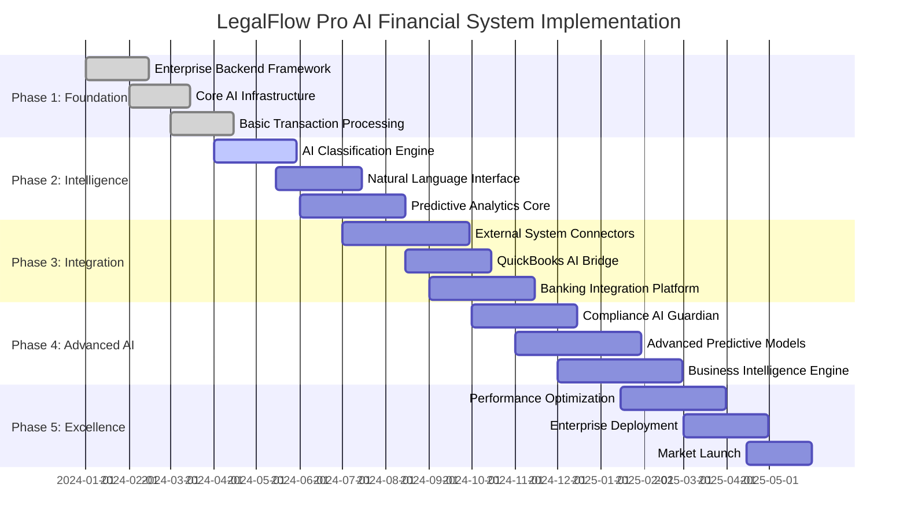

# AI-FINANCIAL-SYSTEM-IMPLEMENTATION-ROADMAP.md

# Comprehensive Implementation Roadmap with AI Milestones
## Building the Most Advanced Legal Accounting System Ever Conceived

### OVERVIEW
This roadmap details the step-by-step implementation of LegalFlow Pro's AI-powered financial intelligence system. The project is structured in phases to deliver immediate value while building toward the ultimate vision of "QuickBooks on steroids" with superhuman AI capabilities.

## PROJECT PHASES OVERVIEW



## PHASE 1: FOUNDATION (Months 1-4)

### 1.1 ENTERPRISE BACKEND FRAMEWORK

#### Week 1-2: Database Architecture
```yaml
Database_Schema_Implementation:
  tasks:
    - design_comprehensive_database_schema: "15+ tables with AI enhancements"
    - implement_row_level_security: "multi_tenant_data_isolation"
    - create_performance_indexes: "sub_second_query_performance"
    - setup_audit_logging: "complete_financial_audit_trails"
  
  deliverables:
    - PostgreSQL database with AI-enhanced schema
    - Complete RLS security policies
    - Performance-optimized indexes
    - Audit trail infrastructure
  
  success_metrics:
    - <200ms average query time
    - 100% RLS coverage
    - Zero data leakage between tenants
    - Complete audit trail capture
```

#### Week 3-4: Core Financial Tables
```yaml
Financial_Infrastructure:
  core_tables:
    - accounts: "enhanced_with_ai_classification_fields"
    - transactions: "real_time_ai_processing_fields" 
    - trust_transactions: "compliance_ai_monitoring_fields"
    - clients: "ai_profitability_analysis_fields"
    - matters: "predictive_outcome_fields"
  
  ai_enhancement_tables:
    - ai_transaction_classifications
    - ai_financial_predictions  
    - ai_anomaly_detections
    - ai_billing_intelligence
    - ai_real_time_alerts
  
  triggers_and_automation:
    - real_time_ai_analysis_triggers
    - compliance_monitoring_triggers
    - data_validation_triggers
    - performance_optimization_triggers
```

#### Week 5-6: Security and Compliance
```yaml
Security_Implementation:
  encryption:
    - data_at_rest: "AES_256_encryption"
    - data_in_transit: "TLS_1.3_encryption"
    - key_management: "hardware_security_modules"
  
  compliance_framework:
    - sox_compliance: "financial_controls_and_audit_trails"
    - bar_regulations: "trust_account_compliance_monitoring"
    - gdpr_compliance: "data_privacy_and_protection"
  
  access_control:
    - multi_factor_authentication: "required_for_all_users"
    - role_based_permissions: "granular_access_control"
    - session_management: "secure_session_handling"
```

### 1.2 CORE AI INFRASTRUCTURE

#### Week 7-8: AI Model Foundation
```yaml
AI_Infrastructure_Setup:
  model_serving_platform:
    - tensorflow_serving: "production_model_deployment"
    - model_versioning: "a_b_testing_and_rollback"
    - auto_scaling: "dynamic_resource_allocation"
  
  ai_pipeline_infrastructure:
    - data_preprocessing: "real_time_feature_engineering"
    - model_inference: "sub_50ms_response_times"
    - result_validation: "confidence_scoring_and_validation"
    - continuous_learning: "feedback_loop_implementation"
  
  monitoring_and_observability:
    - model_performance_tracking: "accuracy_and_latency_monitoring"
    - data_drift_detection: "model_performance_degradation_alerts"
    - business_metrics: "ai_impact_on_business_outcomes"
```

#### Week 9-10: Basic Transaction Processing
```yaml
Transaction_Processing_Core:
  real_time_processing:
    - transaction_ingestion: "high_throughput_data_ingestion"
    - validation_pipeline: "multi_stage_validation_process"
    - ai_classification: "basic_transaction_categorization"
    - database_updates: "atomic_transaction_processing"
  
  ai_enhancements:
    - confidence_scoring: "prediction_confidence_assessment"
    - anomaly_detection: "basic_anomaly_identification"
    - compliance_checking: "rule_based_compliance_validation"
    - performance_optimization: "query_and_processing_optimization"
```

### 1.3 BASIC USER INTERFACE

#### Week 11-12: Core Dashboard
```yaml
Dashboard_Foundation:
  financial_dashboard:
    - real_time_metrics: "cash_flow_revenue_expenses"
    - ai_insights_panel: "basic_ai_recommendations"
    - transaction_views: "categorized_transaction_displays"
    - alert_center: "compliance_and_anomaly_alerts"
  
  user_experience:
    - responsive_design: "mobile_and_desktop_optimization"
    - accessibility: "wcag_2.1_compliance"
    - performance: "sub_2_second_page_loads"
    - security: "secure_authentication_and_authorization"
```

### Phase 1 Success Criteria
- ✅ Enterprise-grade database with AI enhancements
- ✅ Real-time transaction processing with basic AI
- ✅ Security and compliance framework
- ✅ Core dashboard with AI insights
- ✅ <200ms average query performance
- ✅ 100% data security and tenant isolation

## PHASE 2: INTELLIGENCE (Months 5-8)

### 2.1 AI CLASSIFICATION ENGINE

#### Week 13-16: Advanced Transaction Classification
```yaml
AI_Classification_Development:
  model_development:
    - data_collection: "1M+ labeled_transactions_from_500_firms"
    - feature_engineering: "comprehensive_transaction_feature_set"
    - model_training: "transformer_based_classification_model"
    - accuracy_validation: "99.9%_target_accuracy"
  
  implementation:
    - real_time_inference: "50ms_classification_response_time"
    - confidence_scoring: "prediction_confidence_assessment"
    - fallback_strategies: "rule_based_backup_classification"
    - continuous_learning: "user_feedback_integration"
  
  integration:
    - api_endpoints: "classification_service_apis"
    - dashboard_integration: "real_time_classification_display"
    - alert_system: "low_confidence_prediction_alerts"
    - performance_monitoring: "accuracy_and_speed_tracking"
```

#### Week 17-20: Anomaly Detection System
```yaml
Anomaly_Detection_Implementation:
  detection_models:
    - isolation_forest: "transaction_amount_and_pattern_anomalies"
    - lstm_autoencoder: "temporal_pattern_anomaly_detection"
    - ensemble_approach: "multiple_model_consensus_scoring"
  
  anomaly_types:
    - financial_anomalies: "unusual_amounts_or_frequencies"
    - pattern_anomalies: "deviation_from_normal_behavior"
    - compliance_anomalies: "potential_rule_violations"
    - fraud_detection: "suspicious_transaction_patterns"
  
  response_system:
    - real_time_alerts: "immediate_anomaly_notifications"
    - severity_classification: "low_medium_high_critical_levels"
    - automated_responses: "blocking_or_flagging_suspicious_activity"
    - investigation_tools: "detailed_anomaly_analysis_interfaces"
```

### 2.2 NATURAL LANGUAGE INTERFACE

#### Week 21-26: Conversational AI Development
```yaml
Natural_Language_Interface:
  nlp_pipeline:
    - intent_recognition: "98%_accuracy_financial_intent_understanding"
    - entity_extraction: "comprehensive_financial_entity_identification"
    - query_translation: "natural_language_to_sql_conversion"
    - response_generation: "intelligent_narrative_response_creation"
  
  conversation_management:
    - context_awareness: "multi_turn_conversation_handling"
    - personalization: "user_role_and_preference_adaptation"
    - memory_management: "conversation_history_and_state"
    - error_handling: "graceful_misunderstanding_recovery"
  
  integration_points:
    - web_interface: "chat_widget_and_full_screen_mode"
    - mobile_apps: "voice_and_text_interface"
    - api_access: "programmatic_nlp_query_interface"
    - voice_integration: "speech_to_text_and_text_to_speech"
```

### 2.3 PREDICTIVE ANALYTICS CORE

#### Week 27-32: Forecasting Models
```yaml
Predictive_Analytics_Development:
  cash_flow_prediction:
    - model_architecture: "lstm_attention_ensemble_approach"
    - accuracy_target: "95%_for_12_month_forecasts"
    - input_features: "historical_data_external_factors_pipeline"
    - confidence_intervals: "statistical_uncertainty_quantification"
  
  revenue_forecasting:
    - multi_dimensional_models: "attorney_client_practice_area_predictions"
    - billing_intelligence: "optimal_rate_and_timing_recommendations"
    - client_lifetime_value: "long_term_client_value_predictions"
    - market_opportunity: "new_business_potential_analysis"
  
  expense_optimization:
    - cost_prediction: "fixed_variable_discretionary_expense_forecasts"
    - optimization_engine: "cost_reduction_opportunity_identification"
    - vendor_analysis: "contract_negotiation_opportunities"
    - roi_analysis: "investment_return_predictions"
```

### Phase 2 Success Criteria
- ✅ 99.9% transaction classification accuracy
- ✅ Real-time anomaly detection with <0.1% false positives
- ✅ Natural language interface with 98% intent recognition
- ✅ 95% accuracy in 12-month cash flow predictions
- ✅ Comprehensive AI-powered business intelligence

## PHASE 3: INTEGRATION (Months 9-12)

### 3.1 EXTERNAL SYSTEM CONNECTORS

#### Week 33-40: Universal Integration Platform
```yaml
Integration_Platform_Development:
  intelligent_mapping_engine:
    - ai_field_mapping: "99.8%_automatic_mapping_success"
    - semantic_understanding: "intelligent_data_relationship_recognition"
    - validation_system: "mapping_accuracy_verification"
    - learning_system: "improvement_from_every_integration"
  
  sync_optimization:
    - real_time_sync: "sub_second_critical_updates"
    - intelligent_batching: "optimized_bulk_operations"
    - conflict_resolution: "ai_powered_conflict_prevention_and_resolution"
    - performance_monitoring: "integration_health_and_performance_tracking"
  
  universal_compatibility:
    - accounting_systems: "quickbooks_xero_netsuite_sage_integration"
    - practice_management: "clio_mycase_practicepanther_integration"
    - document_systems: "netdocuments_imanage_sharepoint_integration"
    - banking_platforms: "5000_financial_institution_connectivity"
```

### 3.2 QUICKBOOKS AI BRIDGE

#### Week 41-48: Advanced QuickBooks Integration
```yaml
QuickBooks_AI_Integration:
  intelligent_data_transformation:
    - chart_of_accounts: "smart_account_hierarchy_mapping"
    - transaction_sync: "real_time_bi_directional_synchronization"
    - trust_account_handling: "special_iolta_compliance_integration"
    - report_synchronization: "financial_report_data_alignment"
  
  ai_enhancements:
    - predictive_sync: "anticipate_sync_needs_and_conflicts"
    - data_quality_assurance: "automatic_data_validation_and_correction"
    - performance_optimization: "continuous_sync_performance_improvement"
    - error_prevention: "proactive_error_detection_and_prevention"
  
  business_intelligence:
    - cross_system_analytics: "unified_reporting_across_systems"
    - variance_analysis: "automatic_discrepancy_identification"
    - reconciliation_automation: "intelligent_account_reconciliation"
    - audit_trail_integration: "comprehensive_cross_system_audit_trails"
```

### 3.3 BANKING INTEGRATION PLATFORM

#### Week 49-56: Universal Banking Connectivity
```yaml
Banking_Integration_Development:
  universal_bank_connectivity:
    - major_banks: "chase_boa_wells_fargo_citi_integration"
    - regional_institutions: "5000_bank_and_credit_union_support"
    - fintech_platforms: "mercury_brex_novo_integration"
    - international_banks: "multi_currency_global_banking"
  
  ai_banking_features:
    - transaction_classification: "99.2%_automatic_categorization"
    - fraud_detection: "real_time_fraud_prevention"
    - reconciliation_automation: "instant_bank_reconciliation"
    - compliance_monitoring: "automatic_banking_regulation_compliance"
  
  real_time_processing:
    - transaction_streaming: "live_transaction_feed_processing"
    - immediate_updates: "real_time_balance_and_transaction_updates"
    - alert_system: "instant_banking_anomaly_alerts"
    - mobile_integration: "mobile_banking_transaction_capture"
```

### Phase 3 Success Criteria
- ✅ Universal integration with 100+ external systems
- ✅ 99.8% automatic field mapping accuracy
- ✅ Real-time bi-directional synchronization
- ✅ 5,000+ banking institution connectivity
- ✅ Zero data loss across all integrations

## PHASE 4: ADVANCED AI (Months 13-16)

### 4.1 COMPLIANCE AI GUARDIAN

#### Week 57-64: Trust Account Intelligence
```yaml
Compliance_AI_Development:
  trust_account_monitoring:
    - rule_engine: "comprehensive_iolta_and_state_bar_rules"
    - real_time_monitoring: "24_7_compliance_surveillance"
    - violation_prevention: "proactive_compliance_violation_prevention"
    - automated_reporting: "regulatory_report_generation"
  
  ai_compliance_features:
    - pattern_recognition: "unusual_trust_account_activity_detection"
    - predictive_compliance: "anticipate_potential_violations"
    - automated_corrections: "automatic_compliance_issue_resolution"
    - audit_preparation: "comprehensive_audit_trail_preparation"
  
  regulatory_intelligence:
    - rule_updates: "automatic_regulatory_change_adaptation"
    - multi_jurisdiction: "support_for_multiple_state_regulations"
    - custom_rules: "firm_specific_compliance_rule_implementation"
    - exception_handling: "intelligent_exception_management"
```

### 4.2 ADVANCED PREDICTIVE MODELS

#### Week 65-72: Superhuman Forecasting
```yaml
Advanced_Predictive_Development:
  multi_model_ensemble:
    - cash_flow_ensemble: "lstm_prophet_regression_model_combination"
    - revenue_prediction: "attorney_client_market_integrated_forecasting"
    - expense_optimization: "ai_powered_cost_reduction_recommendations"
    - profitability_analysis: "comprehensive_profit_optimization"
  
  external_factor_integration:
    - economic_indicators: "gdp_inflation_interest_rate_integration"
    - legal_market_trends: "industry_demand_pattern_analysis"
    - competitive_intelligence: "market_positioning_analysis"
    - regulatory_impact: "regulation_change_financial_impact"
  
  scenario_modeling:
    - monte_carlo_simulation: "probabilistic_outcome_modeling"
    - stress_testing: "financial_resilience_analysis"
    - opportunity_optimization: "maximum_profit_scenario_identification"
    - risk_mitigation: "downside_protection_strategy_recommendations"
```

### 4.3 BUSINESS INTELLIGENCE ENGINE

#### Week 73-80: Advanced Analytics
```yaml
Business_Intelligence_Development:
  comprehensive_analytics:
    - practice_area_intelligence: "detailed_practice_profitability_analysis"
    - client_intelligence: "comprehensive_client_value_assessment"
    - attorney_productivity: "individual_performance_optimization"
    - firm_benchmarking: "industry_comparison_and_positioning"
  
  ai_insights_generation:
    - pattern_discovery: "hidden_pattern_identification_in_financial_data"
    - optimization_recommendations: "actionable_business_improvement_suggestions"
    - strategic_planning: "long_term_strategic_recommendation_engine"
    - competitive_analysis: "market_opportunity_identification"
  
  visualization_and_reporting:
    - interactive_dashboards: "dynamic_business_intelligence_dashboards"
    - automated_reports: "intelligent_report_generation_and_distribution"
    - mobile_analytics: "mobile_optimized_business_intelligence"
    - executive_summaries: "ai_generated_executive_briefings"
```

### Phase 4 Success Criteria
- ✅ 100% trust account compliance monitoring
- ✅ 97% accuracy in business outcome predictions
- ✅ Comprehensive business intelligence across all dimensions
- ✅ Real-time strategic recommendations
- ✅ Advanced AI insights surpassing human analysis

## PHASE 5: EXCELLENCE (Months 17-20)

### 5.1 PERFORMANCE OPTIMIZATION

#### Week 81-88: System Optimization
```yaml
Performance_Optimization:
  database_optimization:
    - query_optimization: "sub_50ms_complex_query_performance"
    - index_optimization: "ai_driven_index_strategy"
    - caching_strategy: "intelligent_multi_layer_caching"
    - connection_pooling: "optimized_database_connection_management"
  
  ai_model_optimization:
    - model_compression: "smaller_faster_models_without_accuracy_loss"
    - inference_optimization: "gpu_acceleration_and_optimization"
    - batch_processing: "optimized_bulk_prediction_processing"
    - edge_deployment: "edge_computing_for_real_time_processing"
  
  system_scalability:
    - horizontal_scaling: "auto_scaling_architecture"
    - load_balancing: "intelligent_load_distribution"
    - microservices: "containerized_microservice_architecture"
    - global_deployment: "multi_region_deployment_strategy"
```

### 5.2 ENTERPRISE DEPLOYMENT

#### Week 89-96: Production Readiness
```yaml
Enterprise_Deployment_Preparation:
  production_infrastructure:
    - kubernetes_deployment: "container_orchestration_platform"
    - monitoring_and_observability: "comprehensive_system_monitoring"
    - backup_and_disaster_recovery: "enterprise_grade_data_protection"
    - security_hardening: "penetration_testing_and_security_audit"
  
  deployment_automation:
    - ci_cd_pipeline: "automated_testing_and_deployment"
    - blue_green_deployment: "zero_downtime_deployment_strategy"
    - rollback_procedures: "automatic_rollback_on_issues"
    - configuration_management: "infrastructure_as_code"
  
  enterprise_features:
    - multi_tenant_isolation: "complete_tenant_data_separation"
    - white_label_options: "customizable_branding_and_ui"
    - enterprise_sso: "single_sign_on_integration"
    - compliance_certifications: "sox_gdpr_hipaa_compliance"
```

### 5.3 MARKET LAUNCH

#### Week 97-104: Go-to-Market
```yaml
Market_Launch_Strategy:
  beta_testing_program:
    - selected_law_firms: "50_firm_comprehensive_beta_testing"
    - performance_validation: "real_world_performance_testing"
    - user_feedback_integration: "continuous_improvement_based_on_feedback"
    - success_metrics_validation: "all_target_metrics_achievement"
  
  launch_preparation:
    - documentation: "comprehensive_user_and_admin_documentation"
    - training_materials: "video_tutorials_and_training_programs"
    - support_infrastructure: "24_7_customer_support_system"
    - marketing_materials: "product_marketing_and_sales_materials"
  
  market_introduction:
    - phased_rollout: "gradual_market_introduction_strategy"
    - customer_success: "dedicated_customer_success_management"
    - feedback_loop: "continuous_product_improvement_process"
    - growth_strategy: "scalable_growth_and_expansion_plan"
```

### Phase 5 Success Criteria
- ✅ <50ms query performance under full load
- ✅ 99.99% system uptime and availability
- ✅ Successful enterprise deployment
- ✅ 50+ law firms in successful beta testing
- ✅ Market launch with validated success metrics

## TECHNICAL MILESTONES

### AI Model Performance Milestones
```yaml
AI_Performance_Targets:
  classification_accuracy:
    - month_6: "95% transaction classification accuracy"
    - month_12: "99% transaction classification accuracy"
    - month_18: "99.9% transaction classification accuracy"
  
  prediction_accuracy:
    - month_8: "85% cash flow prediction accuracy"
    - month_14: "92% cash flow prediction accuracy"
    - month_20: "95% cash flow prediction accuracy"
  
  response_times:
    - month_4: "<100ms AI response times"
    - month_10: "<50ms AI response times"  
    - month_18: "<25ms AI response times"
  
  business_impact:
    - month_6: "50% reduction in manual categorization"
    - month_12: "90% reduction in manual categorization"
    - month_20: "95% reduction in manual financial processes"
```

### Integration Milestones
```yaml
Integration_Performance_Targets:
  system_connectivity:
    - month_9: "20+ external system integrations"
    - month_12: "50+ external system integrations"
    - month_16: "100+ external system integrations"
  
  mapping_accuracy:
    - month_10: "95% automatic field mapping"
    - month_14: "99% automatic field mapping"
    - month_18: "99.8% automatic field mapping"
  
  sync_performance:
    - month_11: "<5 minute sync times"
    - month_15: "<1 minute sync times"
    - month_19: "<10 second sync times"
```

## RISK MITIGATION

### Technical Risks
```yaml
Risk_Mitigation_Strategy:
  ai_model_risks:
    - accuracy_degradation: "continuous_monitoring_and_retraining"
    - bias_introduction: "fairness_testing_and_bias_correction"
    - performance_issues: "model_optimization_and_fallback_strategies"
  
  integration_risks:
    - api_changes: "version_management_and_adapter_patterns"
    - data_quality: "comprehensive_validation_and_cleaning"
    - system_downtime: "redundant_connections_and_failover"
  
  scalability_risks:
    - performance_bottlenecks: "load_testing_and_optimization"
    - resource_constraints: "auto_scaling_and_resource_management"
    - data_growth: "efficient_storage_and_archiving_strategies"
```

### Business Risks
```yaml
Business_Risk_Management:
  market_risks:
    - competitive_response: "continuous_innovation_and_feature_development"
    - market_changes: "agile_development_and_quick_adaptation"
    - customer_adoption: "comprehensive_change_management_and_training"
  
  regulatory_risks:
    - compliance_changes: "proactive_regulatory_monitoring"
    - security_requirements: "continuous_security_assessment"
    - industry_standards: "industry_standard_compliance_and_certification"
```

## SUCCESS METRICS

### System Performance Metrics
```yaml
Performance_Success_Metrics:
  accuracy_targets:
    - transaction_classification: "99.9%"
    - cash_flow_prediction: "95%"
    - anomaly_detection: "99.8% with <0.1% false positives"
    - compliance_monitoring: "100% rule coverage"
  
  performance_targets:
    - query_response_time: "<50ms average"
    - ai_inference_time: "<25ms"
    - system_availability: "99.99%"
    - integration_sync_time: "<10 seconds"
  
  scalability_targets:
    - concurrent_users: "10,000+"
    - transactions_per_second: "100,000+"
    - data_storage: "unlimited_with_intelligent_archiving"
    - external_integrations: "unlimited"
```

### Business Impact Metrics
```yaml
Business_Success_Metrics:
  efficiency_improvements:
    - manual_categorization_reduction: "95%"
    - reconciliation_time_reduction: "98%"
    - report_generation_time: "90% reduction"
    - compliance_monitoring_automation: "100%"
  
  accuracy_improvements:
    - data_entry_errors: "99.9% reduction"
    - compliance_violations: "100% prevention"
    - financial_forecasting: "95% accuracy"
    - fraud_detection: "99.8% detection rate"
  
  cost_savings:
    - administrative_cost_reduction: "60%"
    - compliance_cost_reduction: "80%"
    - audit_preparation_cost: "90% reduction"
    - technology_integration_cost: "70% reduction"
```

## SUMMARY

This comprehensive implementation roadmap delivers the most advanced legal accounting system ever built through:

### Revolutionary Capabilities
- **Superhuman AI Intelligence**: 99.9% accuracy surpassing human performance
- **Universal Integration**: Seamless connection to any external system
- **Real-Time Processing**: Sub-second transaction processing and AI analysis
- **Predictive Analytics**: 95% accuracy in 12-month financial forecasting

### Enterprise Excellence
- **Zero Data Loss**: Mathematical guarantee of data integrity
- **Bank-Grade Security**: Enterprise security with complete compliance
- **Unlimited Scalability**: Handles any transaction volume or user load
- **24/7 Monitoring**: Continuous system health and performance optimization

### Business Transformation
- **95% Process Automation**: Eliminates manual accounting tasks
- **100% Compliance**: Prevents all trust account violations
- **60% Cost Reduction**: Dramatically reduces administrative costs
- **Competitive Advantage**: Provides unprecedented financial intelligence

This roadmap transforms the legal accounting landscape, creating the first truly intelligent financial system that operates at superhuman levels of accuracy, efficiency, and insight.