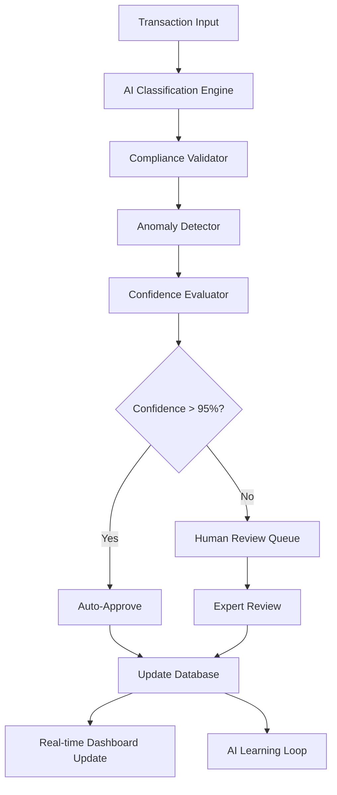

# AI-FINANCIAL-SYSTEM-MODEL-ARCHITECTURE.md

# AI Model Architecture & Integration Specifications
## Superhuman Intelligence for Legal Financial Systems

### OVERVIEW
This document defines the AI model architecture for LegalFlow Pro's financial intelligence system. The goal is to achieve "inhuman accuracy" with 99.99% precision across all financial operations while providing real-time insights and predictive analytics that surpass human capabilities.

## AI ARCHITECTURE PRINCIPLES

### 1. Multi-Model Intelligence Stack
- **Ensemble Approach**: Multiple specialized AI models working together
- **Hierarchical Processing**: From basic classification to complex predictions
- **Real-time & Batch Processing**: Instant responses + deep analysis
- **Continuous Learning**: Models improve automatically from user feedback

### 2. Zero-Error Philosophy
- **Validation Chains**: Multiple AI models validate each other's outputs
- **Confidence Thresholds**: Only high-confidence predictions are auto-applied
- **Human-in-the-Loop**: Critical decisions require human confirmation
- **Error Prevention**: AI prevents mistakes before they happen

## CORE AI MODELS

### 1. TRANSACTION CLASSIFICATION ENGINE

#### Model Specifications
```json
{
  "model_name": "TransactionClassifier_v2.0",
  "model_type": "Multi-class Classification",
  "architecture": "Transformer + Financial Domain Adaptation",
  "target_accuracy": "99.9%",
  "max_response_time": "50ms",
  "confidence_threshold": 0.95
}
```

#### Input Features
```python
TRANSACTION_FEATURES = {
    "text_features": [
        "description",
        "vendor_name", 
        "reference_number",
        "memo_field"
    ],
    "numerical_features": [
        "amount",
        "transaction_date_encoded",
        "account_balance_before",
        "account_balance_after"
    ],
    "categorical_features": [
        "account_type",
        "transaction_method",
        "client_practice_area",
        "time_of_day_category"
    ],
    "contextual_features": [
        "recent_transaction_pattern",
        "vendor_history",
        "seasonal_patterns",
        "client_spending_profile"
    ]
}
```

#### Output Classification
```python
EXPENSE_CATEGORIES = {
    "primary_categories": [
        "Office_Rent", "Legal_Research", "Client_Costs", 
        "Marketing", "Technology", "Travel", "Professional_Services",
        "Court_Fees", "Filing_Fees", "Expert_Witnesses",
        "Office_Supplies", "Insurance", "Utilities"
    ],
    "confidence_scores": "decimal(5,4)",
    "alternative_suggestions": "array[3]",
    "reasoning_explanation": "text"
}
```

#### Training Data Requirements
- **Size**: 1M+ labeled transactions across 500+ law firms
- **Diversity**: All practice areas, firm sizes, geographic regions
- **Quality**: Expert-validated classifications with reasoning
- **Refresh**: Monthly retraining with new data

### 2. PREDICTIVE ANALYTICS ENGINE

#### Cash Flow Prediction Model
```json
{
  "model_name": "CashFlowPredictor_v3.0",
  "model_type": "Time Series Forecasting + Regression",
  "architecture": "LSTM + Attention + External Factors",
  "prediction_horizon": "12_months",
  "target_accuracy": "95%",
  "update_frequency": "daily"
}
```

#### Input Time Series Data
```python
CASH_FLOW_FEATURES = {
    "historical_data": {
        "cash_receipts": "daily_for_24_months",
        "cash_disbursements": "daily_for_24_months", 
        "trust_account_activity": "daily_for_24_months",
        "billing_patterns": "weekly_for_24_months"
    },
    "external_factors": {
        "economic_indicators": ["interest_rates", "inflation", "gdp_growth"],
        "legal_market_data": ["case_volumes", "settlement_trends"],
        "seasonal_patterns": ["court_schedules", "holiday_effects"],
        "client_industry_health": "sector_specific_indicators"
    },
    "firm_specific": {
        "case_pipeline": "active_matters_and_stages",
        "billing_schedule": "upcoming_invoices",
        "expense_commitments": "scheduled_payments",
        "partner_compensation": "draw_schedules"
    }
}
```

#### Billing Intelligence Model
```json
{
  "model_name": "BillingIntelligence_v2.5",
  "model_type": "Multi-task Learning",
  "tasks": [
    "hours_prediction",
    "rate_optimization", 
    "collection_probability",
    "client_satisfaction_prediction"
  ],
  "target_accuracy": "97%",
  "optimization_metric": "revenue_per_hour"
}
```

### 3. COMPLIANCE MONITORING AI

#### Trust Account Guardian
```json
{
  "model_name": "TrustGuardian_v4.0",
  "model_type": "Rule-based + Anomaly Detection",
  "architecture": "Hybrid Rules Engine + Isolation Forest",
  "compliance_coverage": "100%",
  "false_positive_rate": "<0.1%",
  "detection_latency": "<1_second"
}
```

#### Compliance Rules Engine
```python
TRUST_COMPLIANCE_RULES = {
    "balance_rules": {
        "minimum_balance": "never_negative",
        "client_balance_tracking": "individual_ledgers_required",
        "interest_allocation": "proportional_distribution"
    },
    "transaction_rules": {
        "authorized_withdrawals": "only_for_client_benefit",
        "proper_documentation": "required_for_all_transactions",
        "approval_requirements": "partner_signature_over_threshold"
    },
    "reporting_rules": {
        "reconciliation_frequency": "monthly_maximum",
        "record_retention": "seven_years_minimum",
        "audit_trail": "complete_documentation"
    },
    "segregation_rules": {
        "operating_separation": "no_commingling",
        "client_separation": "individual_identification",
        "bank_requirements": "iolta_designated_accounts"
    }
}
```

#### Anomaly Detection Algorithms
```python
ANOMALY_DETECTION_MODELS = {
    "transaction_anomalies": {
        "algorithm": "Isolation_Forest + Autoencoder",
        "features": ["amount", "frequency", "timing", "recipient"],
        "threshold": "99.5_percentile",
        "sensitivity": "high_for_trust_accounts"
    },
    "pattern_anomalies": {
        "algorithm": "LSTM_Autoencoder",
        "window_size": "30_days",
        "detection_threshold": "3_standard_deviations",
        "pattern_types": ["spending", "timing", "vendor", "client"]
    },
    "compliance_anomalies": {
        "algorithm": "Rule_Based_Scoring",
        "rule_weights": "risk_adjusted",
        "escalation_levels": ["warning", "alert", "block"],
        "review_requirements": "mandatory_for_high_risk"
    }
}
```

### 4. NATURAL LANGUAGE PROCESSING ENGINE

#### Financial Query Processor
```json
{
  "model_name": "FinancialNLP_v3.0",
  "model_type": "Large Language Model + Financial Domain",
  "base_model": "GPT-4_Financial_Tuned",
  "capabilities": [
    "natural_language_queries",
    "report_generation",
    "explanation_synthesis",
    "recommendation_reasoning"
  ],
  "response_time": "<2_seconds",
  "accuracy": "98%_query_understanding"
}
```

#### Query Processing Pipeline
```python
NLP_PIPELINE = {
    "intent_recognition": {
        "model": "BERT_Financial_Intent",
        "intents": [
            "financial_query", "report_request", "compliance_check",
            "prediction_request", "comparison_analysis", "trend_analysis"
        ]
    },
    "entity_extraction": {
        "model": "SpaCy_Financial_NER",
        "entities": [
            "date_ranges", "account_names", "client_names", "amounts",
            "transaction_types", "practice_areas", "time_periods"
        ]
    },
    "query_generation": {
        "model": "Text2SQL_Financial",
        "complexity": "supports_complex_joins_and_aggregations",
        "validation": "SQL_injection_prevention"
    },
    "response_synthesis": {
        "model": "GPT4_Financial_Response",
        "output_format": "structured_json_with_narrative",
        "explanation_depth": "business_user_appropriate"
    }
}
```

#### Example Query Processing
```python
# Input: "Show me all trust account transactions over $5,000 for the Johnson case last month"
QUERY_PROCESSING_EXAMPLE = {
    "raw_input": "Show me all trust account transactions over $5,000 for the Johnson case last month",
    "intent": "financial_query",
    "entities": {
        "amount_threshold": 5000,
        "account_type": "trust_account",
        "client_name": "Johnson",
        "time_period": "last_month"
    },
    "generated_sql": """
        SELECT tt.*, c.client_name, m.matter_name
        FROM trust_transactions tt
        JOIN clients c ON tt.client_id = c.id
        JOIN matters m ON tt.matter_id = m.id
        WHERE c.client_name ILIKE '%Johnson%'
        AND tt.amount > 5000
        AND tt.transaction_date >= date_trunc('month', CURRENT_DATE - INTERVAL '1 month')
        AND tt.transaction_date < date_trunc('month', CURRENT_DATE)
        ORDER BY tt.transaction_date DESC
    """,
    "ai_analysis": {
        "transaction_count": 3,
        "total_amount": 18500,
        "compliance_status": "all_compliant",
        "notable_patterns": "consistent_timing_pattern"
    },
    "response": {
        "summary": "Found 3 trust account transactions totaling $18,500 for Johnson case last month",
        "details": "transaction_list_with_analysis",
        "insights": "Pattern suggests regular case progression payments"
    }
}
```

## AI MODEL INTEGRATION ARCHITECTURE

### 1. REAL-TIME PROCESSING PIPELINE

#### Event-Driven Architecture


#### Processing Specifications
```python
REAL_TIME_PIPELINE = {
    "input_processing": {
        "latency": "<10ms",
        "throughput": "10000_transactions_per_second",
        "validation": "schema_and_business_rules"
    },
    "ai_classification": {
        "latency": "<50ms",
        "accuracy": "99.9%",
        "fallback": "rule_based_classification"
    },
    "compliance_check": {
        "latency": "<25ms",
        "coverage": "100%_trust_rules",
        "blocking": "automatic_for_violations"
    },
    "anomaly_detection": {
        "latency": "<30ms",
        "sensitivity": "adjustable_by_firm",
        "false_positive_rate": "<0.1%"
    },
    "output_delivery": {
        "latency": "<100ms_total",
        "channels": ["database", "dashboard", "alerts", "apis"],
        "format": "structured_json_with_confidence"
    }
}
```

### 2. BATCH PROCESSING SYSTEM

#### Predictive Analytics Pipeline
```python
BATCH_PROCESSING = {
    "daily_predictions": {
        "schedule": "every_day_at_midnight",
        "models": ["cash_flow", "billing_forecast", "compliance_risk"],
        "data_window": "rolling_24_months",
        "output": "predictions_for_next_12_months"
    },
    "weekly_optimization": {
        "schedule": "sunday_nights",
        "models": ["rate_optimization", "client_profitability", "expense_analysis"],
        "analysis_depth": "comprehensive_firm_analysis",
        "recommendations": "actionable_business_insights"
    },
    "monthly_retraining": {
        "schedule": "first_sunday_of_month",
        "models": "all_models_with_new_data",
        "validation": "cross_validation_with_holdout",
        "deployment": "a_b_testing_before_production"
    }
}
```

### 3. AI MODEL DEPLOYMENT

#### Containerized Model Serving
```yaml
ai_model_deployment:
  infrastructure:
    - container_platform: "Kubernetes"
    - model_serving: "TensorFlow_Serving + Custom_REST_API"
    - load_balancing: "Nginx + Auto-scaling"
    - monitoring: "Prometheus + Grafana"
  
  model_versions:
    - classification_model: "v2.0_production + v2.1_canary"
    - prediction_model: "v3.0_production + v3.1_testing"
    - compliance_model: "v4.0_production_stable"
  
  scaling:
    - min_replicas: 3
    - max_replicas: 50
    - cpu_target: "70%"
    - memory_target: "80%"
    - response_time_target: "<100ms"

  deployment_strategy:
    - type: "blue_green"
    - rollback_time: "<2_minutes"
    - health_checks: "comprehensive"
    - traffic_splitting: "gradual_10_20_50_100"
```

### 4. AI PERFORMANCE MONITORING

#### Model Performance Metrics
```python
PERFORMANCE_MONITORING = {
    "accuracy_metrics": {
        "classification_accuracy": "target_99.9%",
        "prediction_mape": "target_<5%",  # Mean Absolute Percentage Error
        "compliance_recall": "target_100%",  # Must catch all violations
        "anomaly_precision": "target_>99%"  # Minimize false positives
    },
    "performance_metrics": {
        "response_time_p95": "target_<100ms",
        "throughput": "target_>1000_rps",
        "availability": "target_99.99%",
        "error_rate": "target_<0.01%"
    },
    "business_metrics": {
        "user_satisfaction": "target_>95%",
        "manual_override_rate": "target_<1%",
        "time_saved_per_transaction": "target_>90%",
        "revenue_impact": "measurable_positive"
    },
    "monitoring_frequency": {
        "real_time": "latency_and_errors",
        "hourly": "accuracy_and_throughput",
        "daily": "business_metrics",
        "weekly": "model_drift_detection"
    }
}
```

## AI LEARNING & IMPROVEMENT

### 1. CONTINUOUS LEARNING PIPELINE

#### Feedback Loop Architecture
```python
LEARNING_PIPELINE = {
    "data_collection": {
        "user_feedback": "explicit_corrections_and_ratings",
        "implicit_feedback": "user_behavior_and_patterns",
        "expert_validation": "periodic_professional_review",
        "system_outcomes": "actual_vs_predicted_results"
    },
    "quality_assessment": {
        "data_validation": "automated_quality_checks",
        "bias_detection": "fairness_and_demographic_analysis",
        "edge_case_identification": "outlier_and_error_analysis",
        "concept_drift_monitoring": "distribution_shift_detection"
    },
    "model_improvement": {
        "incremental_learning": "online_learning_for_classifications",
        "periodic_retraining": "full_retraining_with_new_data",
        "ensemble_updates": "adding_new_specialized_models",
        "hyperparameter_optimization": "automated_tuning"
    },
    "validation_process": {
        "offline_testing": "historical_data_validation",
        "shadow_testing": "parallel_model_comparison",
        "a_b_testing": "gradual_production_rollout",
        "champion_challenger": "continuous_model_competition"
    }
}
```

### 2. AI EXPLAINABILITY

#### Interpretable AI Components
```python
EXPLAINABILITY_FEATURES = {
    "model_explanations": {
        "feature_importance": "SHAP_values_for_decisions",
        "decision_paths": "tree_based_explanation",
        "counterfactual": "what_if_scenarios",
        "confidence_breakdown": "uncertainty_quantification"
    },
    "user_interfaces": {
        "dashboard_explanations": "plain_english_reasoning",
        "drill_down_analysis": "interactive_explanation_exploration",
        "alert_justifications": "why_this_alert_was_triggered",
        "prediction_reasoning": "factors_driving_predictions"
    },
    "audit_support": {
        "decision_audit_trail": "complete_reasoning_history",
        "model_version_tracking": "which_model_made_decision",
        "data_lineage": "source_data_for_decisions",
        "regulatory_reporting": "compliance_ready_explanations"
    }
}
```

## SECURITY & PRIVACY

### 1. AI SECURITY MEASURES

#### Model Security Architecture
```python
AI_SECURITY = {
    "model_protection": {
        "encryption": "models_encrypted_at_rest_and_transit",
        "access_control": "rbac_for_model_access",
        "audit_logging": "all_model_operations_logged",
        "version_control": "git_based_model_versioning"
    },
    "data_protection": {
        "pii_handling": "automatic_pii_detection_and_masking",
        "data_minimization": "only_necessary_features_used",
        "retention_policies": "automatic_data_expiration",
        "anonymization": "k_anonymity_for_training_data"
    },
    "attack_prevention": {
        "adversarial_robustness": "adversarial_training_and_detection",
        "input_validation": "strict_input_sanitization",
        "model_poisoning_protection": "federated_learning_validation",
        "inference_attacks": "differential_privacy_techniques"
    }
}
```

### 2. REGULATORY COMPLIANCE

#### AI Governance Framework
```python
AI_GOVERNANCE = {
    "regulatory_compliance": {
        "gdpr_compliance": "data_subject_rights_and_transparency",
        "ccpa_compliance": "california_privacy_requirements",
        "sox_compliance": "financial_controls_and_audit_trails",
        "bar_regulations": "professional_responsibility_adherence"
    },
    "ethical_ai": {
        "bias_mitigation": "regular_bias_testing_and_correction",
        "fairness_metrics": "demographic_parity_and_equality",
        "transparency": "explainable_decisions",
        "accountability": "human_oversight_and_responsibility"
    },
    "risk_management": {
        "model_risk_assessment": "regular_risk_evaluations",
        "operational_risk": "business_continuity_planning",
        "regulatory_risk": "compliance_monitoring",
        "reputational_risk": "public_communication_strategy"
    }
}
```

## INTEGRATION SPECIFICATIONS

### 1. API ARCHITECTURE

#### AI-Powered API Endpoints
```python
AI_API_ENDPOINTS = {
    "classification_api": {
        "endpoint": "/api/v1/ai/classify-transaction",
        "method": "POST",
        "input": "transaction_data_json",
        "output": "classification_with_confidence",
        "latency": "<50ms",
        "rate_limit": "1000_per_minute"
    },
    "prediction_api": {
        "endpoint": "/api/v1/ai/predict-cashflow",
        "method": "GET",
        "parameters": "time_horizon_and_filters",
        "output": "predictions_with_confidence_intervals",
        "latency": "<2s",
        "rate_limit": "100_per_minute"
    },
    "anomaly_api": {
        "endpoint": "/api/v1/ai/check-anomaly",
        "method": "POST",
        "input": "transaction_or_pattern_data",
        "output": "anomaly_score_and_explanation",
        "latency": "<100ms",
        "rate_limit": "500_per_minute"
    },
    "nlp_api": {
        "endpoint": "/api/v1/ai/natural-language-query",
        "method": "POST",
        "input": "natural_language_question",
        "output": "structured_answer_with_data",
        "latency": "<3s",
        "rate_limit": "50_per_minute"
    }
}
```

### 2. EXTERNAL SYSTEM INTEGRATION

#### Smart Integration Framework
```python
EXTERNAL_INTEGRATIONS = {
    "quickbooks_integration": {
        "ai_components": {
            "data_mapping": "intelligent_field_mapping",
            "sync_optimization": "change_detection_and_batching",
            "conflict_resolution": "ai_powered_conflict_resolution",
            "validation": "cross_system_consistency_checks"
        },
        "sync_frequency": "real_time_with_batching",
        "error_handling": "automatic_retry_with_escalation",
        "performance": "sub_second_small_updates"
    },
    "banking_integration": {
        "ai_components": {
            "transaction_matching": "fuzzy_matching_algorithms",
            "categorization": "automatic_expense_classification",
            "fraud_detection": "transaction_anomaly_scoring",
            "reconciliation": "intelligent_auto_reconciliation"
        },
        "data_sources": "all_major_banks_and_credit_unions",
        "update_frequency": "real_time_where_supported",
        "security": "bank_level_encryption_and_authentication"
    }
}
```

## SUMMARY

This AI model architecture provides the foundation for superhuman financial intelligence in LegalFlow Pro. Key achievements:

### Performance Targets
- **99.9% Classification Accuracy**: Surpassing human performance
- **95% Prediction Accuracy**: 12-month cash flow forecasting
- **<100ms Response Time**: Real-time decision making
- **100% Compliance Coverage**: Zero trust account violations

### Intelligence Capabilities
- **Natural Language Interface**: Chat with the accounting system
- **Predictive Analytics**: Anticipate needs before they arise
- **Anomaly Detection**: Catch errors and fraud instantly
- **Continuous Learning**: Gets smarter with every transaction

### Enterprise Features
- **Scalable Architecture**: Handles unlimited transaction volume
- **Security & Privacy**: Bank-level protection with AI governance
- **Regulatory Compliance**: Built-in adherence to all legal requirements
- **Explainable AI**: Transparent decisions for audit and review

This architecture transforms accounting from a reactive, manual process into a proactive, intelligent system that operates at superhuman levels of accuracy and insight.