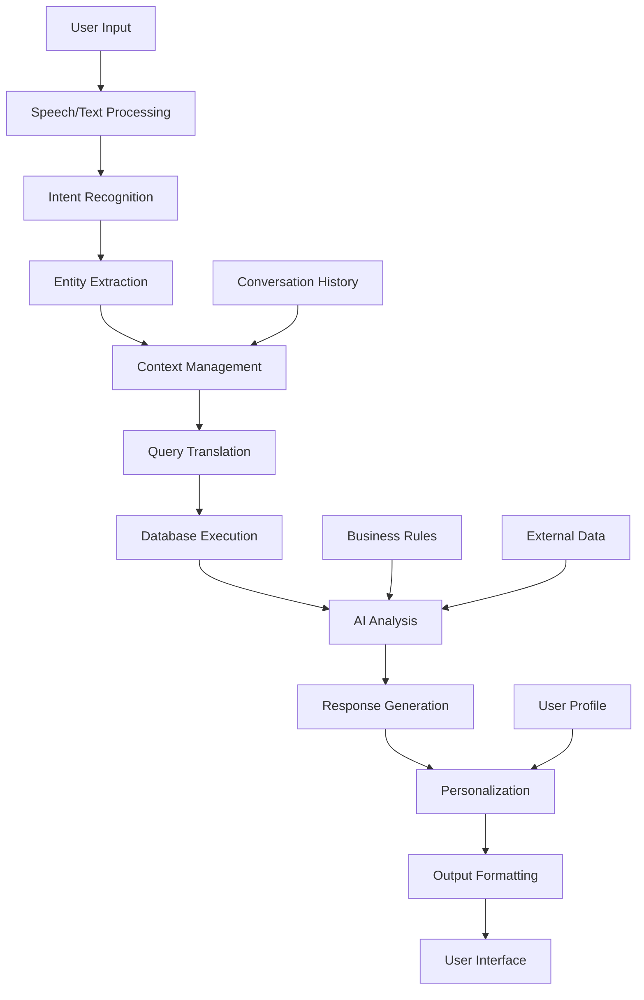

# AI-FINANCIAL-SYSTEM-NATURAL-LANGUAGE-INTERFACE.md

# Natural Language Interface Specifications
## Chat with Your Accounting System Like a CFO

### OVERVIEW
The Natural Language Interface (NLI) transforms how legal professionals interact with their financial data. Instead of navigating complex menus and generating reports manually, users can simply ask questions in plain English and receive intelligent, contextual responses with supporting data and insights.

## CORE CAPABILITIES

### 1. CONVERSATIONAL FINANCIAL INTELLIGENCE

#### Chat Interface Features
```javascript
const NLI_CAPABILITIES = {
  query_types: [
    "financial_questions",      // "What's our cash flow this month?"
    "report_requests",         // "Create a P&L for Johnson case"
    "data_exploration",        // "Show me our biggest expenses"
    "compliance_checks",       // "Are all trust accounts compliant?"
    "predictive_queries",      // "When will we hit $1M revenue?"
    "comparative_analysis",    // "Compare this quarter to last year"
    "trend_analysis",         // "What's our billing trend?"
    "alert_summaries"         // "What compliance issues need attention?"
  ],
  
  response_formats: [
    "conversational_text",     // Natural language explanations
    "structured_data",         // Tables, charts, graphs
    "actionable_insights",     // Recommendations and next steps
    "drill_down_options",      // "Would you like me to show..."
    "contextual_suggestions"   // Related questions users might ask
  ],
  
  interaction_modes: [
    "single_question",         // One-off queries
    "conversation_flow",       // Multi-turn conversations
    "guided_exploration",      // AI suggests follow-up questions
    "proactive_insights",      // AI volunteers important information
    "scheduled_briefings"      // Daily/weekly AI summaries
  ]
}
```

#### Conversation Flow Examples
```javascript
// Example 1: Cash Flow Analysis
USER: "How is our cash flow looking?"

AI_RESPONSE: {
  summary: "Your cash flow is strong this month with $47,300 net positive flow",
  details: {
    cash_in: "$156,800 (up 12% from last month)",
    cash_out: "$109,500 (down 3% from last month)", 
    net_flow: "$47,300 positive",
    trend: "improving_for_3_consecutive_months"
  },
  insights: [
    "Trust account receipts are 18% higher than usual",
    "Office expenses decreased due to remote work adoption",
    "Client payments are coming in 2.3 days faster on average"
  ],
  next_actions: [
    "Consider investing excess cash in short-term instruments",
    "Review expense categories for further optimization opportunities"
  ],
  follow_up_suggestions: [
    "Would you like to see the cash flow forecast for next quarter?",
    "Should I show you which clients are contributing most to this growth?",
    "Want to compare this to the same period last year?"
  ]
}

// Example 2: Trust Account Compliance
USER: "Are there any trust account issues I should know about?"

AI_RESPONSE: {
  compliance_status: "All trust accounts are compliant with 2 items requiring attention",
  summary: "No violations detected, but I found 2 optimization opportunities",
  details: {
    total_trust_accounts: 12,
    compliant_accounts: 12,
    flagged_transactions: 0,
    pending_reconciliations: 1
  },
  attention_items: [
    {
      type: "optimization",
      description: "Johnson case trust account has been idle for 45 days",
      recommendation: "Consider contacting client about case status",
      impact: "low"
    },
    {
      type: "efficiency", 
      description: "Wilson matter reconciliation is 3 days overdue",
      recommendation: "Reconcile today to maintain compliance schedule",
      impact: "medium"
    }
  ],
  proactive_insights: [
    "Trust account interest allocation is 99.7% accurate",
    "Average reconciliation time has improved by 40% this quarter",
    "No pattern anomalies detected in trust transactions"
  ]
}
```

### 2. INTELLIGENT QUERY PROCESSING

#### Natural Language Understanding Pipeline
```python
NLU_PIPELINE = {
    "intent_recognition": {
        "model": "FinancialBERT_v2.0",
        "intents": {
            "financial_query": "questions about current financial state",
            "historical_analysis": "trends and comparisons over time", 
            "predictive_question": "future forecasts and projections",
            "compliance_check": "regulatory and rule adherence",
            "report_generation": "formatted reports and documents",
            "alert_inquiry": "notifications and warnings",
            "recommendation_request": "advice and suggestions",
            "data_export": "extracting data for external use"
        },
        "confidence_threshold": 0.90,
        "fallback_strategy": "clarification_questions"
    },
    
    "entity_extraction": {
        "model": "SpaCy_Legal_Financial_NER",
        "entities": {
            "temporal": ["dates", "periods", "quarters", "fiscal_years"],
            "financial": ["amounts", "accounts", "transactions", "budgets"],
            "legal": ["clients", "matters", "cases", "practice_areas"],
            "people": ["attorneys", "staff", "contacts"],
            "locations": ["offices", "courts", "jurisdictions"],
            "documents": ["invoices", "reports", "statements"]
        },
        "context_awareness": "uses_conversation_history",
        "disambiguation": "clarifies_ambiguous_references"
    },
    
    "query_translation": {
        "model": "Text2SQL_Legal_Tuned",
        "capabilities": {
            "complex_joins": "multi_table_relationships",
            "aggregations": "sums_averages_counts_trends",
            "time_series": "date_range_and_period_analysis", 
            "filtering": "dynamic_where_clauses",
            "sorting": "intelligent_result_ordering"
        },
        "validation": {
            "sql_injection_prevention": "parameterized_queries",
            "permission_checking": "user_access_validation",
            "performance_optimization": "query_plan_analysis"
        }
    }
}
```

#### Context Management
```python
CONTEXT_MANAGEMENT = {
    "conversation_memory": {
        "short_term": "current_session_context",
        "medium_term": "recent_conversations_24h",
        "long_term": "user_preferences_and_patterns",
        "session_persistence": "maintains_context_across_refreshes"
    },
    
    "contextual_understanding": {
        "pronoun_resolution": "this_that_it_references",
        "temporal_context": "last_month_previous_quarter",
        "entity_tracking": "follows_mentioned_clients_matters",
        "assumption_validation": "confirms_unclear_references"
    },
    
    "personalization": {
        "user_role_awareness": "partner_associate_admin_paralegal",
        "permission_filtering": "shows_only_accessible_data",
        "preference_learning": "adapts_to_user_communication_style",
        "domain_expertise": "adjusts_complexity_for_user_level"
    }
}
```

### 3. ADVANCED QUERY TYPES

#### Financial Analysis Queries
```javascript
const FINANCIAL_QUERY_EXAMPLES = {
  cash_flow: [
    "What's our cash position?",
    "Show me cash flow for Q3",
    "How does this month compare to last month?",
    "What's driving our cash flow changes?",
    "When do we expect our next cash crunch?"
  ],
  
  profitability: [
    "Which clients are most profitable?", 
    "What's our profit margin by practice area?",
    "Show me matter profitability for Johnson case",
    "How much did we make on intellectual property work last quarter?",
    "Which attorney generates the most revenue per hour?"
  ],
  
  expenses: [
    "What are our biggest expense categories?",
    "How much did we spend on legal research this year?",
    "Show me travel expenses by attorney",
    "Are our office costs trending up or down?",
    "What's our cost per billable hour?"
  ],
  
  billing: [
    "How much do we have in unbilled time?",
    "Show me billing by client for last month", 
    "What's our average collection time?",
    "Which invoices are overdue?",
    "How's our billing efficiency compared to last year?"
  ]
}
```

#### Trust Account Queries
```javascript
const TRUST_ACCOUNT_QUERIES = {
  compliance: [
    "Are all trust accounts compliant?",
    "Show me any trust account violations",
    "What trust transactions need review?",
    "Is the Johnson trust account properly reconciled?",
    "Are we following all IOLTA requirements?"
  ],
  
  balance_tracking: [
    "What's the balance in the Wilson trust account?",
    "Show me all trust account balances",
    "How much money do we hold for each client?",
    "Which trust accounts have been idle longest?",
    "What's our total trust liability?"
  ],
  
  transaction_analysis: [
    "Show me trust deposits for the Martinez case",
    "What trust account withdrawals happened last week?",
    "Are there any unusual trust account patterns?",
    "How much interest was allocated to each client?",
    "Which trust transactions are largest this month?"
  ]
}
```

#### Predictive and Analytical Queries
```javascript
const PREDICTIVE_QUERIES = {
  forecasting: [
    "What will our revenue be next quarter?",
    "When will we reach $2M in annual revenue?",
    "How much cash will we have in 6 months?",
    "What's our projected profit for this fiscal year?",
    "When should we hire our next associate?"
  ],
  
  trend_analysis: [
    "How is our billing trending?",
    "Are client payments getting slower?",
    "What's the trend in our overhead costs?",
    "How has attorney productivity changed?",
    "Is our profitability improving?"
  ],
  
  comparative_analysis: [
    "How does this quarter compare to last quarter?",
    "Show me year-over-year revenue growth",
    "Compare our efficiency to industry benchmarks",
    "How do our rates compare to similar firms?",
    "Which practice areas are growing fastest?"
  ]
}
```

### 4. INTELLIGENT RESPONSE GENERATION

#### Response Architecture
```python
RESPONSE_GENERATION = {
    "data_synthesis": {
        "query_execution": "optimized_database_queries",
        "data_aggregation": "intelligent_summarization",
        "insight_generation": "pattern_recognition_and_analysis",
        "context_enrichment": "additional_relevant_information"
    },
    
    "narrative_construction": {
        "executive_summary": "key_findings_in_business_terms",
        "detailed_analysis": "supporting_data_and_breakdowns", 
        "insights_and_patterns": "what_the_data_reveals",
        "recommendations": "actionable_next_steps",
        "caveats_and_assumptions": "limitations_and_context"
    },
    
    "visual_components": {
        "charts_and_graphs": "automatically_generated_visualizations",
        "tables_and_lists": "structured_data_presentation",
        "trend_indicators": "up_down_stable_with_percentages",
        "alert_highlights": "important_items_emphasized",
        "interactive_elements": "drill_down_and_filter_options"
    },
    
    "follow_up_suggestions": {
        "related_questions": "what_else_user_might_want_to_know",
        "deeper_analysis": "more_detailed_exploration_options",
        "action_items": "suggested_steps_to_take",
        "monitoring_setup": "alerts_and_watch_items",
        "export_options": "report_generation_and_sharing"
    }
}
```

#### Response Personalization
```python
PERSONALIZATION_ENGINE = {
    "role_based_responses": {
        "managing_partner": {
            "focus": "high_level_metrics_and_strategic_insights",
            "detail_level": "executive_summary_with_key_numbers",
            "recommendations": "strategic_and_growth_oriented",
            "alerts": "critical_items_only"
        },
        "practice_group_leader": {
            "focus": "practice_area_performance_and_efficiency",
            "detail_level": "tactical_metrics_with_comparisons",
            "recommendations": "operational_improvements",
            "alerts": "practice_specific_issues"
        },
        "attorney": {
            "focus": "individual_productivity_and_matter_profitability",
            "detail_level": "matter_level_detail",
            "recommendations": "time_management_and_billing_optimization",
            "alerts": "deadline_and_compliance_reminders"
        },
        "administrator": {
            "focus": "operational_metrics_and_compliance",
            "detail_level": "detailed_transaction_level_data",
            "recommendations": "process_improvements_and_controls",
            "alerts": "all_system_notifications"
        }
    },
    
    "communication_style": {
        "formal": "professional_business_language",
        "conversational": "friendly_but_professional_tone",
        "technical": "detailed_financial_terminology",
        "simplified": "plain_english_explanations"
    },
    
    "information_density": {
        "summary": "key_points_only",
        "standard": "balanced_overview_with_details",
        "comprehensive": "complete_analysis_with_all_supporting_data",
        "drill_down": "progressive_disclosure_based_on_user_interest"
    }
}
```

### 5. PROACTIVE INTELLIGENCE

#### AI-Initiated Conversations
```python
PROACTIVE_FEATURES = {
    "intelligent_alerts": {
        "cash_flow_warnings": "ai_predicts_cash_shortfalls_30_days_out",
        "compliance_reminders": "trust_reconciliation_due_dates",
        "opportunity_identification": "rate_increase_opportunities",
        "anomaly_notifications": "unusual_patterns_detected",
        "performance_insights": "productivity_trends_and_benchmarks"
    },
    
    "daily_briefings": {
        "morning_summary": "overnight_transactions_and_alerts",
        "performance_update": "key_metrics_vs_targets",
        "priority_items": "tasks_requiring_attention",
        "market_intelligence": "relevant_industry_news",
        "schedule_coordination": "upcoming_financial_deadlines"
    },
    
    "contextual_suggestions": {
        "workflow_optimization": "suggests_process_improvements",
        "cross_selling_opportunities": "identifies_client_expansion_potential",
        "resource_planning": "hiring_and_capacity_recommendations",
        "investment_advice": "cash_management_suggestions",
        "technology_upgrades": "system_improvement_recommendations"
    }
}
```

#### Automated Report Generation
```python
AUTOMATED_REPORTING = {
    "scheduled_reports": {
        "daily_flash": "key_metrics_and_alerts_every_morning",
        "weekly_performance": "comprehensive_financial_dashboard",
        "monthly_analysis": "detailed_p&l_and_trend_analysis", 
        "quarterly_review": "strategic_financial_assessment",
        "annual_planning": "budget_vs_actual_with_next_year_projections"
    },
    
    "triggered_reports": {
        "threshold_alerts": "automatic_reports_when_metrics_exceed_limits",
        "compliance_reports": "generated_when_regulatory_deadlines_approach",
        "client_reports": "automated_client_financial_summaries",
        "matter_completion": "profitability_analysis_when_matters_close",
        "billing_cycle": "revenue_and_collection_analysis_after_billing"
    },
    
    "custom_intelligence": {
        "user_defined_metrics": "tracks_firm_specific_kpis",
        "competitive_analysis": "benchmarking_against_industry_peers",
        "scenario_planning": "what_if_analysis_for_strategic_decisions",
        "risk_assessment": "financial_risk_monitoring_and_reporting",
        "growth_tracking": "progress_toward_firm_growth_goals"
    }
}
```

### 6. INTEGRATION WITH VOICE INTERFACES

#### Voice-Activated Financial Intelligence
```python
VOICE_INTEGRATION = {
    "speech_recognition": {
        "model": "Legal_Financial_ASR_v2.0",
        "accuracy": "98%_for_financial_terminology",
        "noise_handling": "office_environment_optimized",
        "multi_speaker": "speaker_identification_and_separation"
    },
    
    "voice_commands": {
        "quick_queries": "Hey LegalFlow, what's our cash balance?",
        "report_requests": "Generate this month's P&L report",
        "alert_checks": "Any compliance issues I should know about?",
        "scheduling": "Remind me about trust reconciliation next Friday",
        "dictation": "Add expense for client lunch, $47.50, Johnson matter"
    },
    
    "response_delivery": {
        "text_to_speech": "natural_sounding_voice_responses",
        "visual_confirmation": "display_confirms_voice_interpretation",
        "hands_free_operation": "complete_voice_only_interaction",
        "interruption_handling": "graceful_conversation_management"
    }
}
```

### 7. MOBILE AND MULTI-PLATFORM SUPPORT

#### Cross-Platform Natural Language Interface
```python
PLATFORM_SUPPORT = {
    "web_interface": {
        "chat_widget": "persistent_chat_in_main_application",
        "full_screen_mode": "dedicated_ai_conversation_interface",
        "sidebar_integration": "contextual_ai_help_in_workflows",
        "keyboard_shortcuts": "power_user_quick_access"
    },
    
    "mobile_apps": {
        "ios_android": "native_mobile_apps_with_voice_support",
        "progressive_web": "responsive_web_interface",
        "offline_capability": "cached_responses_for_common_queries",
        "push_notifications": "proactive_alerts_and_insights"
    },
    
    "integrations": {
        "slack_integration": "query_legalflow_from_slack_channels",
        "teams_integration": "microsoft_teams_bot_interface",
        "email_interface": "email_based_queries_and_responses",
        "api_access": "third_party_application_integration"
    }
}
```

## TECHNICAL IMPLEMENTATION

### 1. ARCHITECTURE OVERVIEW

#### System Components


#### Technology Stack
```python
TECHNOLOGY_STACK = {
    "natural_language_processing": {
        "intent_recognition": "Transformers + Custom Financial Training",
        "entity_extraction": "SpaCy + Custom Legal/Financial NER",
        "text_generation": "GPT-4 + Domain-Specific Fine-tuning",
        "sentiment_analysis": "FinBERT + Legal Domain Adaptation"
    },
    
    "query_processing": {
        "text_to_sql": "CodeT5 + SQLCoder Fine-tuned for Legal Schema",
        "query_optimization": "PostgreSQL Query Planner + AI Optimization",
        "caching": "Redis + Intelligent Query Result Caching",
        "security": "Parameterized Queries + Permission Validation"
    },
    
    "response_generation": {
        "data_analysis": "Pandas + NumPy + Custom Analytics Engine",
        "visualization": "D3.js + Chart.js + Auto-Chart Generation",
        "narrative_generation": "GPT-4 + Template-Based Synthesis",
        "personalization": "User Modeling + Collaborative Filtering"
    },
    
    "infrastructure": {
        "api_framework": "FastAPI + Async Processing",
        "real_time_communication": "WebSocket + Server-Sent Events",
        "scalability": "Kubernetes + Auto-scaling",
        "monitoring": "Prometheus + Grafana + Custom AI Metrics"
    }
}
```

### 2. PERFORMANCE SPECIFICATIONS

#### Response Time Targets
```python
PERFORMANCE_TARGETS = {
    "query_processing": {
        "simple_queries": "<500ms",          # "What's our cash balance?"
        "complex_analysis": "<2s",           # "Compare profitability across practice areas"
        "report_generation": "<5s",          # "Generate monthly P&L"
        "predictive_queries": "<3s",         # "Forecast next quarter revenue"
        "voice_recognition": "<300ms"        # Speech to text processing
    },
    
    "throughput": {
        "concurrent_users": "500+ simultaneous conversations",
        "queries_per_second": "1000+ across all users",
        "conversation_persistence": "unlimited conversation history",
        "session_management": "100,000+ active sessions"
    },
    
    "accuracy": {
        "intent_recognition": "98%+ accuracy",
        "entity_extraction": "97%+ accuracy", 
        "query_translation": "99%+ valid SQL generation",
        "response_relevance": "95%+ user satisfaction"
    }
}
```

### 3. SECURITY AND PRIVACY

#### Data Protection Measures
```python
SECURITY_FRAMEWORK = {
    "conversation_security": {
        "encryption": "end_to_end_encryption_for_all_conversations",
        "access_control": "user_authentication_and_authorization",
        "audit_logging": "complete_conversation_audit_trails",
        "data_retention": "configurable_conversation_retention_policies"
    },
    
    "query_security": {
        "sql_injection_prevention": "parameterized_queries_only",
        "permission_enforcement": "row_level_security_integration",
        "rate_limiting": "prevents_abuse_and_dos_attacks",
        "input_validation": "comprehensive_input_sanitization"
    },
    
    "ai_model_security": {
        "model_protection": "encrypted_model_storage_and_execution",
        "adversarial_robustness": "tested_against_prompt_injection",
        "data_privacy": "no_conversation_data_used_for_training",
        "federated_learning": "privacy_preserving_model_updates"
    }
}
```

## SUMMARY

The Natural Language Interface transforms LegalFlow Pro into an intelligent financial advisor that users can communicate with naturally. Key capabilities include:

### User Experience
- **Conversational Intelligence**: Ask questions in plain English, get smart answers
- **Contextual Understanding**: Maintains conversation context and user preferences
- **Proactive Insights**: AI volunteers important information and recommendations
- **Multi-Platform Access**: Works on web, mobile, voice, and integrated platforms

### Technical Excellence
- **Sub-Second Response**: <500ms for simple queries, <2s for complex analysis
- **High Accuracy**: 98%+ intent recognition, 99%+ valid query generation
- **Scalable Architecture**: Supports 500+ concurrent conversations
- **Enterprise Security**: End-to-end encryption with complete audit trails

### Business Impact
- **Democratized Analytics**: Makes complex financial analysis accessible to all users
- **Increased Efficiency**: Eliminates manual report generation and data exploration
- **Better Decision Making**: Provides instant access to insights and recommendations
- **Reduced Training**: Natural language eliminates need for system training

This Natural Language Interface makes LegalFlow Pro the first accounting system that truly understands and responds to human communication, creating an experience like having a CFO available 24/7.