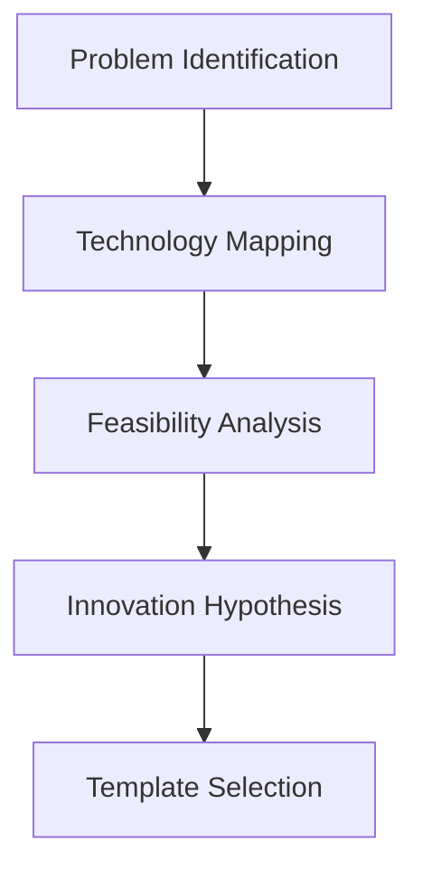
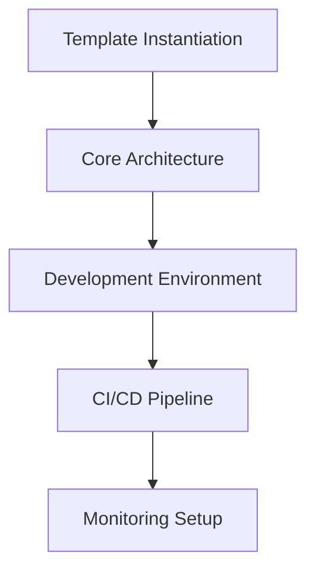
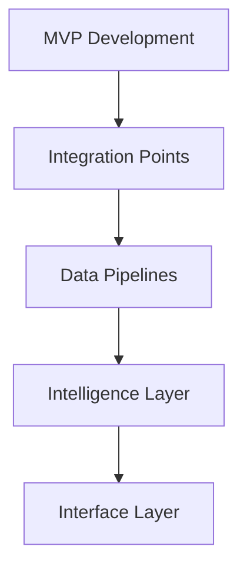
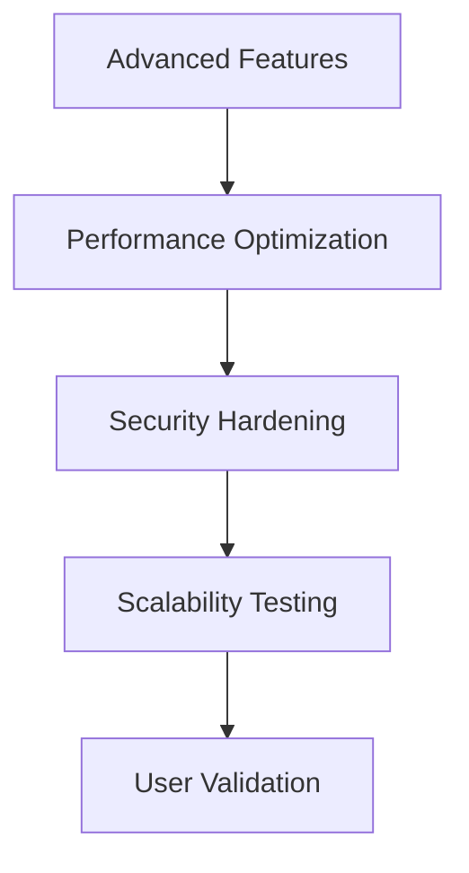
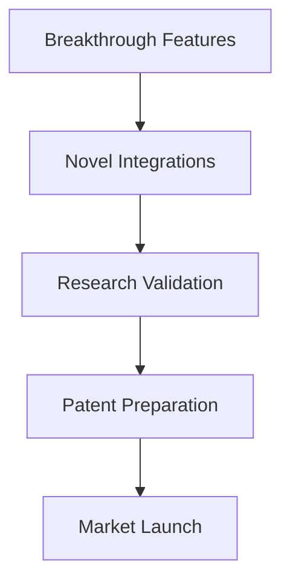

# DropFly Innovation Framework 🧪

**AI Engineering Scientist's Guide to Breakthrough Development**

## 🎯 Innovation Philosophy

### **Future-First Thinking**
- Design for technologies that don't exist yet
- Build with 10x scalability in mind
- Anticipate paradigm shifts before they happen
- Create solutions that evolve with emerging tech

### **Cross-Domain Integration**
- Combine multiple innovation domains
- Create synergies between disparate technologies
- Build bridges between physical and digital worlds
- Enable emergent behaviors through integration

### **Research-Driven Development**
- Hypothesis-driven feature development
- Continuous experimentation and validation
- Scientific method applied to engineering
- Evidence-based decision making

## 🧬 Universal Innovation DNA

Every DropFly innovation project shares this genetic code:

### **Core Components**
```
innovation-project/
├── 🧠 intelligence/         # AI/ML capabilities
├── 🔄 real-time/           # Live processing & streaming
├── 🌐 connectivity/        # Network & communication
├── 🔒 security/            # Security & privacy
├── 📊 analytics/           # Data processing & insights
├── 🎮 interfaces/          # Human-computer interaction
├── 🏗️ infrastructure/      # Deployment & scaling
├── 🧪 experiments/         # Research & validation
├── 🔧 automation/          # Self-managing systems
└── 🚀 deployment/          # Multi-environment deployment
```

### **Innovation Layers**
1. **Physical Layer** - Hardware, sensors, actuators
2. **Protocol Layer** - Communication and networking
3. **Data Layer** - Storage, processing, streaming
4. **Intelligence Layer** - AI/ML, analytics, automation
5. **Interface Layer** - APIs, UIs, human interaction
6. **Application Layer** - Business logic and workflows
7. **Experience Layer** - User experience and interfaces

## 🚀 Rapid Innovation Process

### **Phase 1: Ideation (Days 1-3)**


**Activities:**
- Define the breakthrough opportunity
- Map relevant technology domains
- Assess technical feasibility
- Formulate testable hypotheses
- Select appropriate templates

### **Phase 2: Foundation (Week 1)**


**Activities:**
- Instantiate selected templates
- Design core system architecture
- Set up development environments
- Configure deployment pipelines
- Implement monitoring and observability

### **Phase 3: Core Development (Weeks 2-4)**


**Activities:**
- Build minimum viable product
- Implement integration points
- Set up data processing pipelines
- Add AI/ML capabilities
- Create user interfaces

### **Phase 4: Enhancement (Weeks 5-8)**


**Activities:**
- Implement advanced features
- Optimize for performance
- Harden security measures
- Test scalability limits
- Validate with real users

### **Phase 5: Innovation (Weeks 9-12)**


**Activities:**
- Develop breakthrough capabilities
- Create novel technology integrations
- Validate research hypotheses
- Prepare intellectual property
- Launch to market

## 🔬 Experimental Framework

### **Hypothesis-Driven Development**
```python
class InnovationExperiment:
    def __init__(self, hypothesis, success_metrics):
        self.hypothesis = hypothesis
        self.success_metrics = success_metrics
        self.control_group = None
        self.treatment_group = None
        
    def design_experiment(self):
        # Statistical experiment design
        pass
        
    def run_experiment(self, duration_days):
        # Execute controlled experiment
        pass
        
    def analyze_results(self):
        # Statistical analysis of results
        pass
        
    def make_decision(self):
        # Data-driven decision making
        pass
```

### **Innovation Metrics**
- **Technical Metrics**: Performance, reliability, scalability
- **User Metrics**: Engagement, satisfaction, retention
- **Business Metrics**: ROI, market impact, competitive advantage
- **Research Metrics**: Novelty, citation potential, IP value

## 🌊 Technology Convergence Patterns

### **AI + IoT = Intelligent Things**
- Edge AI for autonomous devices
- Predictive IoT analytics
- Self-optimizing sensor networks

### **Blockchain + AI = Decentralized Intelligence**
- Federated learning on blockchain
- AI-powered smart contracts
- Decentralized AI marketplaces

### **Quantum + AI = Exponential Computing**
- Quantum machine learning
- Quantum neural networks
- Quantum optimization algorithms

### **XR + AI = Immersive Intelligence**
- AI-powered virtual worlds
- Intelligent avatar systems
- Predictive AR interfaces

## 🎨 Design Principles for Innovation

### **1. Composability**
- Build with LEGO-like modularity
- Enable rapid recombination
- Support multiple use cases

### **2. Evolvability**
- Design for continuous improvement
- Enable self-modifying systems
- Support version migration

### **3. Observability**
- Make everything measurable
- Enable real-time monitoring
- Support debugging and optimization

### **4. Resilience**
- Build anti-fragile systems
- Handle failures gracefully
- Recover stronger from disruptions

### **5. Sustainability**
- Optimize for energy efficiency
- Minimize environmental impact
- Enable circular economy patterns

## 🔮 Future-Proofing Strategies

### **Technology Readiness**
- Stay 2-3 years ahead of mainstream adoption
- Build abstractions for emerging technologies
- Create migration paths for new paradigms

### **Adaptive Architecture**
- Design for unknown future requirements
- Enable runtime reconfiguration
- Support evolutionary changes

### **Innovation Pipeline**
- Maintain 3-5 experimental projects
- Balance incremental vs. breakthrough innovation
- Create innovation tournaments

## 🏆 Innovation Success Patterns

### **The 10x Rule**
- Aim for 10x improvement, not 10%
- Question fundamental assumptions
- Rethink the entire problem space

### **The Adjacent Possible**
- Build on what's just becoming possible
- Combine mature technologies in novel ways
- Create enabling technologies for others

### **The Network Effect**
- Design for viral adoption
- Create value that increases with users
- Enable ecosystem development

## 📚 Innovation Resources

### **Research Sources**
- arXiv.org - Latest research papers
- Google Scholar - Academic citations
- Nature/Science - Breakthrough discoveries
- IEEE Xplore - Technical standards

### **Technology Tracking**
- Gartner Hype Cycle - Technology maturity
- MIT Technology Review - Emerging tech
- CB Insights - Market trends
- GitHub Trending - Developer adoption

### **Innovation Communities**
- Y Combinator - Startup innovation
- DARPA - Government research
- Bell Labs - Industrial research
- Google X - Moonshot projects

---

**DropFly Innovation Framework** - Systematically creating breakthrough technologies that shape the future.

*"Innovation distinguishes between a leader and a follower."* - Steve Jobs